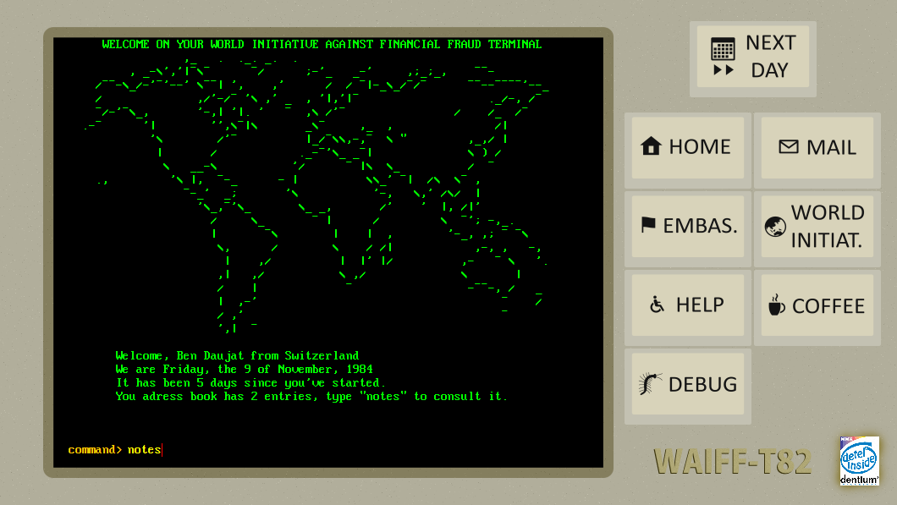

A mock-up for a game expanded from a school project. Essentially does two things :

- Simulate the behaviour of a number of agents (people/corporations) making money, opening accounts in banks, starting up new companies, contacting other countries... Some of them are doing so in order to fraud, and the game using that system would be to try and identify fraudulent transactions and go up the chain until the criminal is found.

- Try to imitate an old-timey terminal to see whether messing with the interface is worthwhile for the ambiance. I have found games toying with the interface (such as *Uplink* or *Papers, Please*) very interesting, and I wanted to try it for myself.

